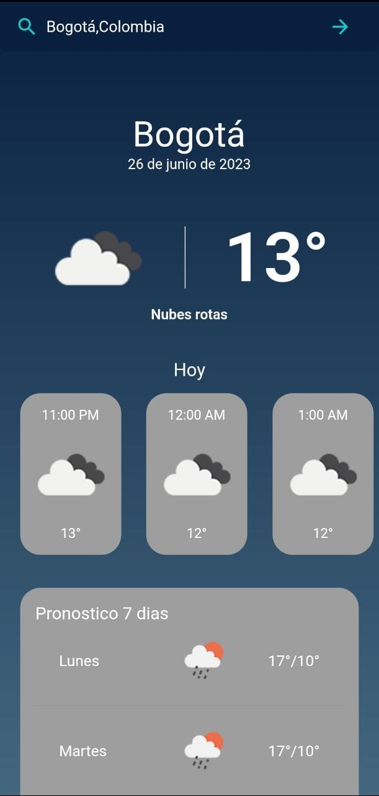

# **App_clima usando Flutter**
Esta aplicación sigue la arquitectura limpia propuesta por el tío Bob 
Utilicé BloC como administración de estado para mejorar el rendimiento de reconstrucción de widgets. 
## Descargar App
<a href="https://drive.google.com/file/d/1QNKDNA38WquAdk6m-wUA6IsPZ4kyGdin/view?usp=sharing"></img></a >

## Capturas de pantalla

<h3> 1- Home Page </h3>

<p align="center">
  
</p>

##Paquetes comunes
- Equatables para la igualdad de objetos
- get_it para la inyección de dependencias
- Bloc para la gestión del Estado
- Http para solicitudes HTTP
- Dartz para devolver dos valores de funciones
- Flutter_screenutil para dimensiones segun diseño
- Internet_connection_checker para revisar conexion a internet
- Geolocator para obtener mi ubicacion

## Tecnologías
- [x] Arquitectura limpia ([BLoC](https://pub.dev/packages/flutter_bloc))
- [x] Inserción de dependencias ([GetIt](https://pub.dev/packages/get_it))
## Estructura
```
lib
├───core
│   ├───constants
│   ├───error
│   ├───network
│   ├───route
│   └───utils
├── dependency_injection.dart
├── main.dart
└───feature
    ├───weather
    │   ├───data
    │   │   ├───datasource
	│   │   ├───repositories
    │   │   └───models
	│   ├───domain
    │   │   ├───entities
    │   │   ├───contracts
    │   │   └───usecases
    │   └───presentation
    │       ├───bloc
    │       ├───pages
    │       └───widgets


